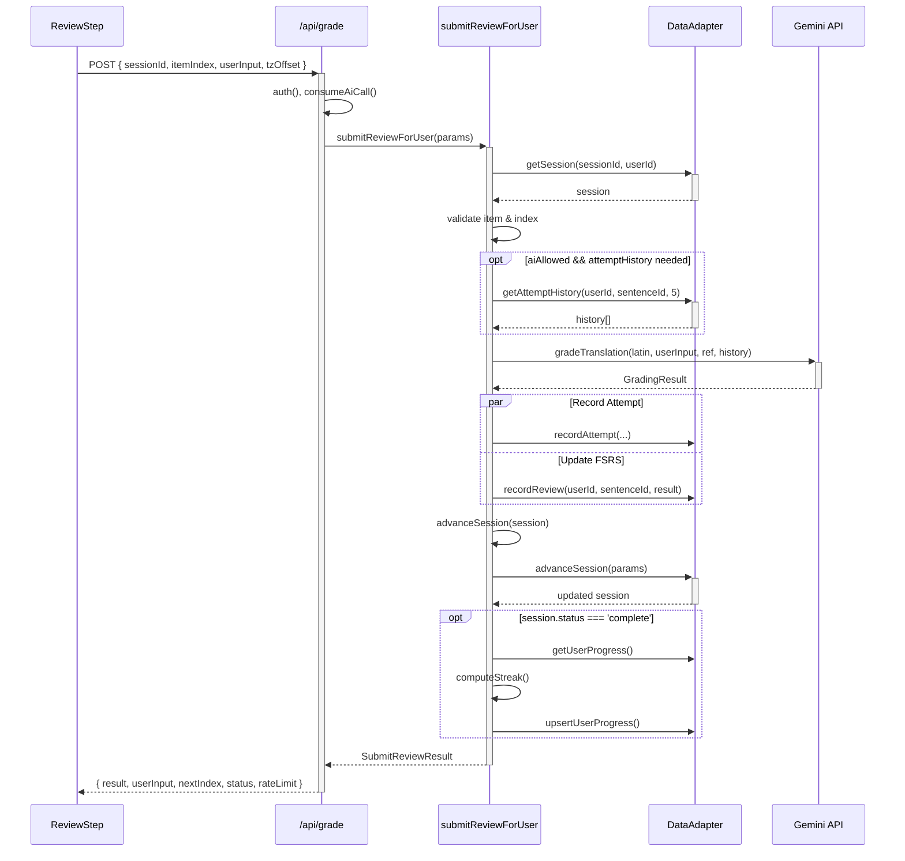
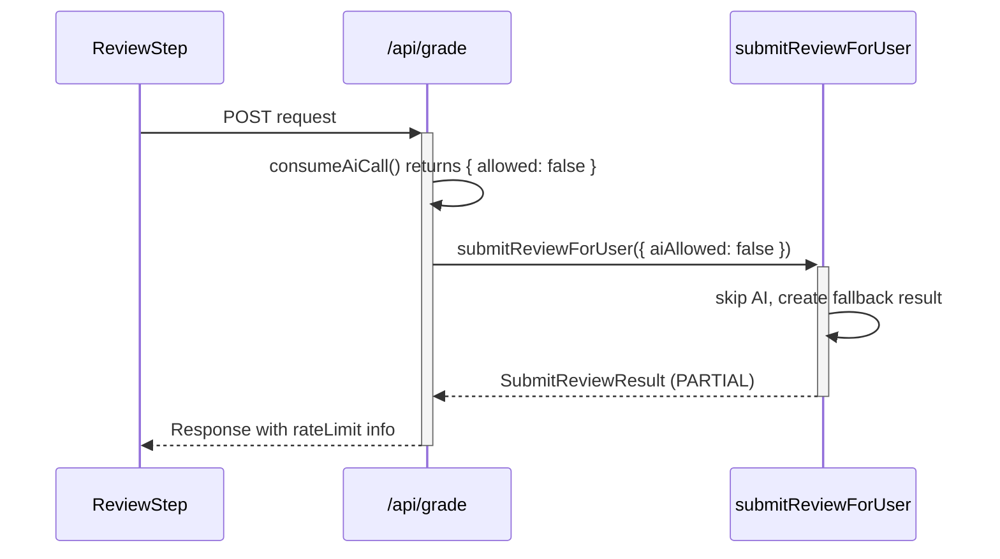
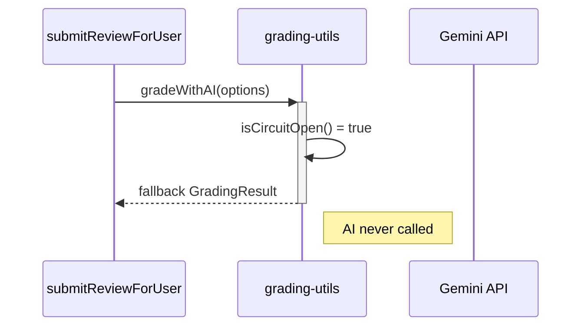
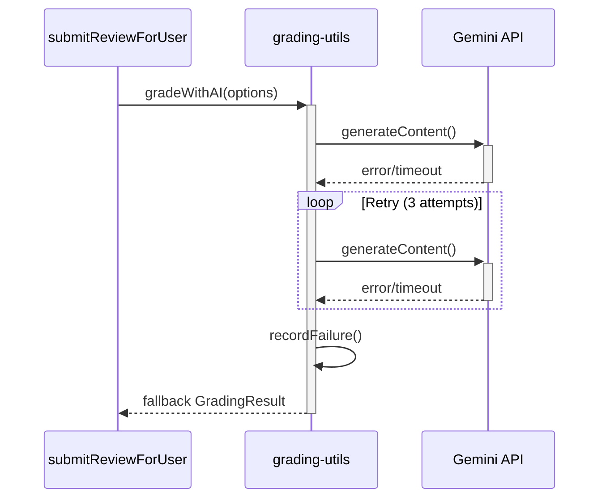
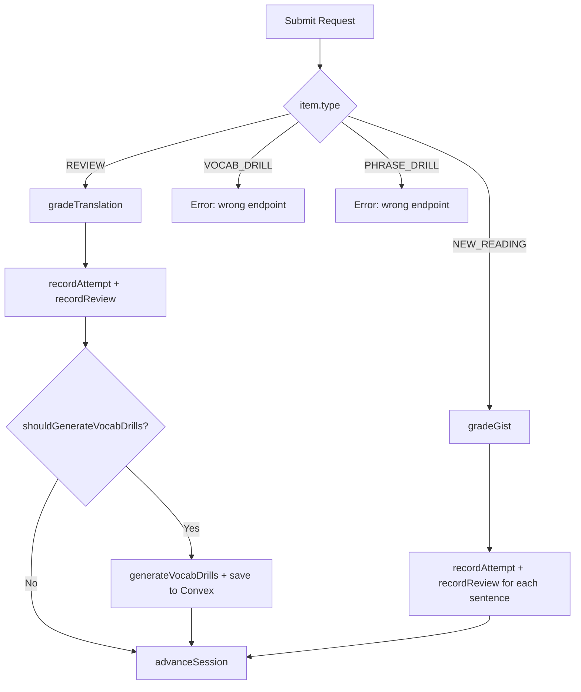

# AI Grading Data Flow

Documents the request-response chain for translation grading.

## Happy Path Sequence

## Error Paths

### Rate Limited (aiAllowed=false)

### Circuit Breaker Open

### Gemini API Failure

## Best-Effort Operations

These operations run but failures don't block the response:

| Operation | Purpose | Failure Impact |
|-----------|---------|----------------|
| `recordAttempt()` | Store attempt history | No history-aware grading later |
| `recordReview()` | Update FSRS state | Card won't be properly scheduled |
| `generateVocabDrills()` | Create vocab cards for struggling | Missing remediation content |
| `upsertUserProgress()` | Update XP/streak | Stats may be stale |

All wrapped in try/catch with console.error logging.

## Session Item Type Routing

## Vocab/Phrase Drill Endpoints

Separate from main `/api/grade` route:

- `/api/vocab-review` - VocabDrillStep submissions
- `/api/phrase-review` - PhraseDrillStep submissions

Both use `gradeVocab()` / `gradePhrase()` AI functions with simpler schemas.
