# Session Flow State Machine

This documents the state transitions in the learning session flow.

## Session Orchestration (SessionClient)

Linear progression through a queue of items. Simple enough that code is the diagram.

```
[Start] --> item[0] --> item[1] --> ... --> item[n-1] --> [/summary]
```

## Review Step State Machine

The ReviewStep component has a 4-state machine with async transitions.


### States

| State | `feedback` | `isSubmitting` | UI |
|-------|-----------|----------------|-----|
| INPUT | null | false | textarea, submit button |
| SUBMITTING | null | true | GradingLoader |
| FEEDBACK | GradingResult | false | Margin feedback card |
| FEEDBACK_FALLBACK | fallback result | false | Same as FEEDBACK but advancePayload=null |

### Error Handling

- API failure: Shows fallback feedback with reference translation
- Network timeout: Caught by try/catch, same fallback path
- advancePayload is null on error, allowing retry (user re-enters flow)

## Reading Step State Machine

Identical structure to ReviewStep. Uses gradeGist instead of gradeTranslation.


### Glossary Source Switching

- Before feedback: `reading.glossary` (static, from content)
- After feedback: `aiGlossary` (from `result.analysis.glossary`)

## Vocab/Phrase Drill State Machines

Structurally identical to Review/Reading. Simpler feedback (no error details).


Fallback on error: Shows PARTIAL status with generic message.

## AI Grading Circuit Breaker


### Transitions

| Event | From | To | Action |
|-------|------|-----|--------|
| AI call succeeds | CLOSED | CLOSED | `consecutiveFailures = 0` |
| AI call fails | CLOSED | CLOSED/OPEN | `consecutiveFailures++`, if >= 5 -> OPEN |
| Any call | OPEN | OPEN | Return fallback immediately |
| Timer (60s) | OPEN | HALF_OPEN | Allow single trial call |
| Trial succeeds | HALF_OPEN | CLOSED | Reset failures |
| Trial fails | HALF_OPEN | OPEN | Back to OPEN, restart timer |

## FSRS Card State Machine (ts-fsrs)


### Rating Mapping

```typescript
INCORRECT -> Again (forgot, relearn)
PARTIAL   -> Hard  (struggled, slow advance)
CORRECT   -> Good  (recalled, normal advance)
```

Never use Easy - quiz grading can't detect "effortless recall".

## Streak State Machine

```mermaid
stateDiagram-v2
    [*] --> NO_STREAK: first visit

    NO_STREAK --> STREAK_1: complete session

    STREAK_1 --> STREAK_1: same day
    STREAK_1 --> STREAK_N: next day (n=2)
    STREAK_1 --> DECAYED: gap > 1 day

    STREAK_N --> STREAK_N: same day
    STREAK_N --> STREAK_N: next day (n++)
    STREAK_N --> DECAYED: gap > 1 day

    DECAYED --> STREAK_1: complete session
```



### Edge Cases

- DST boundary: May be off by 1 day (acceptable for MVP)
- Timezone changes: Uses client-provided offset at completion time
- Display decay: `getCurrentStreak()` returns 0 if stale, even if stored value > 0
